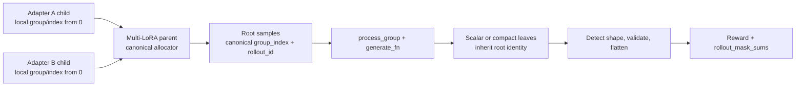

<Warning title="P0 已实现，后续仍是草案">

P0 已在当前工作树中实现并验证，但尚未 commit 或 push。
P1 和 `Sample.index` retirement 仍是待批准方案，不代表当前稳定契约。
Canonical decision thread 是 [issue #2378](https://github.com/radixark/miles/issues/2378)。

</Warning>

## 状态与本次决策

**状态：** P0 已实现并通过本地验证；P1 和字段 retirement 仍为中文设计草案。
当前授权不包含 commit、push，也不包含删除兼容字段。

**证据基线：** Miles `main` 固定在 [`93b77615`](https://github.com/radixark/miles/tree/93b77615ffb3852aaefb107a04b1edae0e4f7124)，PR [#2369](https://github.com/radixark/miles/pull/2369) 固定在 [`b9c1063d`](https://github.com/radixark/miles/tree/b9c1063d30caa51d53e7346694ca01bf968a66d5)，companion PR [#2368](https://github.com/radixark/miles/pull/2368) 固定在 [`b32f1173`](https://github.com/radixark/miles/tree/b32f1173b8b5a92073da7f1748440095a6e9b29c)。

截至 2026-08-12，issue #2378 和 PR #2369 都仍然 open，PR #2369 仍只修改 1 个 production 文件和 1 个测试文件。

**本次已实施 P0：** 修复 live Multi-LoRA batch 中 child-local identity 碰撞导致的 loss denominator 串扰。

**本次不请求批准：** 删除 `Sample.index`、修改 `sample_indices` schema、修改 dashboard API、迁移旧 dump/checkpoint、实现 retry、修 same-name re-registration、实现完整 dynamic fanout。

## 为什么上一版看起来很大

上一版把四件不同的事合成了一个 program：修 issue #2378、修 Multi-LoRA denominator collision、修 compact leaf 的 dashboard join、彻底删除并重命名所有 `index` 契约。Issue #2378 由 PR #2369 处理；本次 P0 只处理第二个 bug。Dashboard join 和 `Sample.index` retirement 都不属于本次。

`Sample.index` 的直接代码引用确实不多。较大的数字来自它向外衍生出的三个独立契约：train payload 的 `sample_indices`、dashboard/dump 的 `sample_index`、以及相关 API/frontend/tests。只有在要求“字段、schema、API 名称全部删除或改名”时，才需要审计这些传递消费者。

上一版 broad grep 还误算了三类同名但语义无关的局部变量：`session/samples/codec.py` 的 tensor array ordinal、`dp_schedule.py` 的 batch-local row position，以及 `session_verify_agent.py` 的 verification report ordinal。它们不属于 `Sample.index` retirement。

| 范围 | Production 改动 | 测试改动 | 估算 | 是否属于本次 |
|---|---:|---:|---:|---|
| P0：修 live Multi-LoRA denominator collision | 3 个文件 | 4 个文件 | 实际 94 production + 203 test changed lines | 是，已实现 |
| P1：让 built-in training math 不再 fallback 到 `index` | 5–7 个文件 | 3–5 个文件 | 约 130–280 changed LOC | 可选后续 |
| 只删除 `Sample.index` 字段但保留外部兼容名 | 17 个 core/example 文件 | 对应 producer、eval、dump 和 conversion tests | 约 250–450 changed LOC | 否 |
| 连 `sample_indices`、dashboard `sample_index` 和 URL 一起改名 | 28 个 core/example 文件和 2 个 docs | 另含 dashboard/witness tests | 约 450–800 changed LOC | 否 |

因此，上一版的“大改动面”是完整 retirement 的上界，不是当前修复的成本。本设计把 retirement 降为独立选择，不再计入 P0。

## Motivation

Issue [#2378](https://github.com/radixark/miles/issues/2378) 的核心目标是：compact 或 agentic rollout 产生多个 leaf rows 时，一个 logical rollout 在 reward normalization 中只能贡献一次，leaf 数量不能改变它的统计权重。PR [#2369](https://github.com/radixark/miles/pull/2369) 正在处理这部分。

审计同时发现一个独立的现有 bug：Multi-LoRA 为每个 adapter 创建独立 `RolloutDataSource`，每个 child 的 `index/group_index` 都从 0 开始；train conversion 在 `Sample.rollout_id` 缺失时 fallback 到 child-local `Sample.index`，随后 `_compute_rollout_mask_sums` 按裸整数聚合。两个 adapter 的 local rollout zero 因而可能共享一个 loss denominator。

P0 完成后，用户可观察到：两个 adapter 都可以产生 local `index=0`，但 reward group、logical rollout 和 loss-mask denominator 仍完全隔离；compact siblings 仍共享一个 logical rollout ID；普通非-compact output 的 trim 和 dynamic-global-batch 行为不变。

## 术语和 single source of truth

| 语义 | Canonical 字段或值 | Scope |
|---|---|---|
| Batch rollout ID | manager/hook/dump 参数中的 `rollout_id` | 一次外层 training rollout iteration |
| Logical rollout ID | `Sample.rollout_id` | 一次 environment/generation execution；compact siblings 共享 |
| Prompt group ID | `Sample.group_index` | 一个 prompt reward-comparison group |
| Adapter route | `AdapterRef(name, slot)` | `slot` 只负责参数路由，可复用，不是永久 identity |
| Legacy sample ID | `Sample.index` | 当前兼容字段；P0 后不承担 Multi-LoRA training math identity |
| Flattened row position | flatten 后的局部位置 | 只在一个 batch rollout 内定位 row；P0 不新增该字段 |

本设计不把 `group_index`、`rollout_id` 和 row position 合成一个 ID，因为它们对应不同层级。Single source of truth 的含义是：每种语义只有一个 owner，而不是所有层级共用一个整数。

## 当前事实

### Identity production

**当前事实：** `RolloutDataSource` 初始化 `sample_group_index=0` 和 `sample_index=0`，复制 prompt 后写入 `group_index/index` 并递增。参见 [`miles/rollout/data_source.py`](https://github.com/radixark/miles/blob/93b77615ffb3852aaefb107a04b1edae0e4f7124/miles/rollout/data_source.py#L49-L158)。

**当前事实：** `MultiLoRAAsyncDataSource` 维护 `dict[adapter_name, RolloutDataSource]`，因此每个 adapter child 都拥有独立且从零开始的 namespace。父级目前只 stamp `AdapterRef(name, slot)` 和 reward 配置，没有 canonicalize identity。参见 [`miles/rollout/multi_lora/data_source.py`](https://github.com/radixark/miles/blob/93b77615ffb3852aaefb107a04b1edae0e4f7124/miles/rollout/multi_lora/data_source.py#L31-L132)。

**当前事实：** Training 依靠 `adapter_slots` 正确路由 LoRA 参数。Identity collision 不会把 A 的 token 送进 B 的参数；它污染的是 loss normalization 的 denominator。

### Identity consumption

**当前事实：** PR #2369 head 中，train conversion 写入 `rollout_ids=[sample.rollout_id if present else sample.index]`，而 `_compute_rollout_mask_sums` 使用这个裸值作为 batch-wide dictionary key。参见 [`train_data_conversion.py`](https://github.com/radixark/miles/blob/b9c1063d30caa51d53e7346694ca01bf968a66d5/miles/ray/rollout/train_data_conversion.py#L73-L101) 和 [mask aggregation](https://github.com/radixark/miles/blob/b9c1063d30caa51d53e7346694ca01bf968a66d5/miles/ray/rollout/train_data_conversion.py#L162-L169)。

若 adapter A 的 local zero 有 `mA` 个 loss-mask tokens，adapter B 的 local zero 有 `mB` 个，当前两行 denominator 都会成为 `mA + mB`；正确结果应分别为 `mA` 和 `mB`。

**当前事实：** PR #2369 使用 flatten 前保存的 `prompt_group_sizes` 保护标准 Multi-LoRA reward grouping，因此 reward normalization 的 group collision 已被部分处理；`rollout_mask_sums` 仍使用裸 logical rollout integer，没有获得同样保护。

**当前事实：** `postprocess_rollout_data` 当前通过“是否存在非空 `rollout_id`”判断 compact。若 P0 给普通 roots 也填 `rollout_id`，必须先把 shape detection 与 identity 解耦，否则会错误跳过 trim/dynamic-global-batch 路径。

## 方案选择

### 方案 A：只把 mask key 改成 `(adapter, local_id)`

这是最小 symptom patch，可能只改 1 个 production 文件和少量测试。但 reward、metrics、后续 scheduler 和其他 consumer 仍然各自决定 namespace，single source of truth 没有建立。

### 方案 B：Multi-LoRA parent 一次性分配 canonical IDs

**推荐：** Multi-LoRA parent 是唯一同时看到所有 child namespaces 的边界。在这里为 prompt group 和每个 root rollout 分配 canonical IDs，下游继续使用普通整数，不需要每个 consumer 重新组合 `(adapter, local_id)`。

### 方案 C：现在直接删除 `Sample.index`

这不是修 denominator bug 的必要条件。删除字段本身不难，但必须分别替换它目前承担的 root identity、eval ordering、dump join、dashboard lookup 和 logging 角色；是否保留外部字段名也是独立 contract decision。因此不放进 P0。

## P0 详细设计



### 1. Parent allocator

`MultiLoRAAsyncDataSource` 新增 process-lifetime `next_group_index` 和 `next_rollout_id`。每次从任意 child 取得一个新 prompt group 时：

- 整个 prompt group 分配一个 canonical `group_index`。
- group 中每个 root candidate 分配一个 canonical `rollout_id`。
- child-local `Sample.index` 保持不变，仅用于现有兼容路径。
- allocator 不因 adapter 删除、slot 复用或 round-robin 切换而重置。

P0 不持久化 parent counters，也不承诺跨 actor/checkpoint restart 唯一。P0 上线前必须确认 restart 不会保留旧 allocator lifetime 产生的 completed/in-flight buffer；若会保留，persistence 或 identity epoch 将升级为 P0 blocker。

### 2. Root-to-leaf propagation

`miles/rollout/multi_lora/async_rollout.py::process_group` 是必需的传播 owner。它将输入 `group` 与 `generate_fn` 返回值按 top-level position 对齐：

- 返回 item 是单个 `Sample` 时，继承对应 root 的 `group_index`、`rollout_id` 和 `AdapterRef`。
- 返回 item 是 `list[Sample]` 时，所有 leaves 继承对应 root identity。
- 返回值 top-level cardinality 改变时直接报错，因为无法无歧义确定 root mapping。
- leaf 缺 identity 时补齐；leaf 显式携带冲突 identity 时直接报错。

PR #2368 只覆盖 session-v2 的 `rollout_id` 传播；它不能替代这个 Multi-LoRA common boundary。

### 3. Shape detection 与 identity 解耦

`postprocess_rollout_data` 在 flatten 前根据真实嵌套结构计算 `has_compact_outputs`。普通 `list[list[Sample]]` 不是 compact；某个 root 返回多个 leaves 才是 compact。`Sample.rollout_id` 是否为空不再用作 shape signal。

### 4. P0 lifecycle boundary

当前 Multi-LoRA aborted group 会被丢弃，child `RolloutDataSource.add_samples()` 是 read-only，因此 P0 不新增 retry。Same-name re-registration child reuse 和 parent allocator checkpoint 也是独立 lifecycle 问题，不捎带进 denominator fix。

## P0 改动面

下面的文件数是相对 PR #2369 head `b9c1063d` 的增量；P0 设计为 stacked change，依赖 #2369 已有的 reward normalization 修复。若直接从 `main` 实现，#2369 的 1 个 production 文件和 1 个测试文件属于 prerequisite，不计入这个 P0 delta。

### Production：固定 3 个文件

| 文件 | 改动 |
|---|---|
| `miles/rollout/multi_lora/data_source.py` | 分配 process-lifetime canonical `group_index/rollout_id` |
| `miles/rollout/multi_lora/async_rollout.py` | `process_group` 执行 root-to-leaf propagation 和冲突校验 |
| `miles/ray/rollout/rollout_data_conversion.py` | 使用真实嵌套结构判断 compact，保持 trim/dynamic batch 行为 |

### Tests：固定 4 个文件

| 文件 | 覆盖 |
|---|---|
| 新增 `tests/fast/ray/rollout/test_multi_lora_data_source.py` | 两个 child 都从 0 开始，但 parent IDs 不碰撞 |
| `tests/fast/ray/rollout/test_multi_lora_process_group.py` | root-to-leaf mapping、cardinality/conflict failure、aborted 行为不变 |
| `tests/fast/ray/rollout/test_multi_lora_train_data.py` | A/B denominator 和 reward group 隔离 |
| `tests/fast/ray/rollout/test_rollout_data_conversion.py` | 普通/compact shape、trim、dynamic-global-batch |

**实际改动：** 94 production changed lines，加 203 test changed lines，共 297 changed lines。
文件范围仍严格是上述 3 个 production 文件和 4 个测试文件。

“固定”基于当前实现的两个已验证边界：aborted group 不会 requeue 到 child source，且 `process_group` 当前按 top-level position 接收每个 root 的结果。P0 只支持这两个现有契约；若 regression 证明数据会跨 parent lifetime 持久化，或 top-level positional mapping 不成立，则停止实现并重新定范围，不自动给 P0 增加 persistence、mapping schema 或新的 owner。

## P0 实施顺序

1. 先增加真实 collision regression：两个实际 child source 都产生 `group_index=0/index=0`，证明当前 denominator 错误。
2. 在 parent DataSource 分配 canonical IDs，断言同一 group 一致、不同 roots 唯一。
3. 在 `process_group` 传播 identity，并增加 scalar、leaf list、cardinality mismatch、conflict 四类测试。
4. 将 compact 判断改为基于嵌套 shape，跑普通输出的 trim/dynamic batch regression。
5. 贯穿 conversion，断言 adapter routing 不变，A/B 的 mask totals 和实际 loss denominator 各自独立。

## P0 stop conditions

- 两个 adapter 的 child-local `group_index/index` 都从 0 开始，但 parent canonical IDs 不碰撞。
- A 的 `rollout_mask_sums` 只包含 A tokens，B 同理。
- PR #2369 的 reward groups 仍隔离，compact siblings 仍只贡献一个 logical reward。
- `process_group` 对 scalar 和 leaf-list output 正确传播 identity，对 cardinality/conflict 直接失败。
- 普通 output 即使带 `rollout_id`，trim 和 dynamic-global-batch 行为与基线一致。
- `adapter_slots`、token counts 和 optimizer routing 与基线一致。
- Aborted group 仍被丢弃；P0 不改变 retry、re-registration、checkpoint、custom converter、dashboard 或 dump schema。

## P0 验证命令

```bash
pytest -q tests/fast/ray/rollout/test_multi_lora_data_source.py
pytest -q tests/fast/ray/rollout/test_multi_lora_train_data.py
pytest -q tests/fast/ray/rollout/test_multi_lora_process_group.py
pytest -q tests/fast/ray/rollout/test_rollout_data_conversion.py
```

精确 P0 gate 结果为 `27 passed`。
包含相邻 Multi-LoRA 和 train-data tests 的扩展 gate 结果为 `91 passed`。
Black、isort、Python compile 和 `git diff --check` 均通过；当前环境未安装 Ruff。

## P0 rollback

Parent allocation、`process_group` propagation 和 shape detection 必须一起回滚。旧 `index` fallback 仍保留，因此代码可以回到原行为；新增 collision test 会重新失败，明确暴露 correctness regression。

## 可选 P1：停止 training math 对 `Sample.index` 的依赖

P1 不是 P0 前置。只有当 maintainers 希望 built-in training path 完全以 `rollout_id/group_index` 为 single source of truth 时才实施。

P1 包含：

- `RolloutDataSource.get_samples()` 在分配 root 时显式写入 `rollout_id`。
- Multi-LoRA parent 继续覆盖 child-local `rollout_id`，形成跨 adapter namespace。
- 在 flatten 前建立唯一 legacy/debug compatibility branch。
- Provably single-source legacy input 可以从 `index` materialize `rollout_id`。
- Legacy Multi-LoRA 使用 `(registration_id if present else adapter.name, legacy index)` dense re-key 为 batch-local canonical integers；无法消歧时失败。
- Producer 和 compatibility branch 完成后，删除 reward/mask/scheduler/metrics 中现场执行的 `rollout_id else index`。

P1 预计修改 5–7 个 production 文件和 3–5 个测试，约 130–280 changed LOC。完成 P1 后，即使 `Sample.index` 暂时保留给 observability，training math 已经只有一个 logical identity source。

## `Sample.index` 是否要删除

这需要单独确认 external contract license，不能从“training math 不再使用它”自动推导。

| 选择 | 行为 | 改动面 |
|---|---|---|
| 保留字段但降级为 legacy observability | P1 后 training math 不再读取它；旧 dump/dashboard 不动 | 最小，推荐先停在这里 |
| 删除 `Sample.index`，但保留 `sample_indices/sample_index` 这些外部名字 | 外部名字重新定义为 flatten row position，需要迁移 writer/reader 和 fixtures | 17 个 core/example 文件，约 250–450 changed LOC |
| 删除字段并重命名所有 schema/API/frontend 路由 | 同时修改 train payload、dashboard URL、JS 和 docs | 28 个 core/example 文件和 2 个 docs，约 450–800 changed LOC |

直接删除 dataclass 字段本身确实不大；真正的成本是决定它目前承担的每个角色由谁接管：

| 当前角色 | 正确替代 |
|---|---|
| Logical rollout accounting | `Sample.rollout_id` |
| Prompt grouping | `Sample.group_index` |
| Flattened train-row join | batch-local row position |
| Eval completion ordering | eval-local ordinal |
| Router stickiness | `routing_key` |
| Lifecycle correlation | logical rollout ID，而不是 leaf row ID |

没有必要为了删除一个名字，在同一个 PR 中改完所有外部契约。推荐先完成 P0；若目标是 single source of truth for training，再做 P1；只有明确要求清理 public/debug contracts 时才规划 retirement。

## 风险与待确认项

### P0 blocker

1. 用现有 lifecycle regression 确认 Multi-LoRA worker/DataSource restart 不会保留旧 allocator lifetime 的 completed/in-flight buffer；若证伪，停止 P0 并为 persistence 或 epoch 重新定范围。
2. 用现有 `process_group` contract regression 确认 custom `generate_fn` 的 top-level result 与 input roots 保持同位置映射；若证伪，停止 P0 并为显式 mapping schema 重新定范围。

### 不属于 P0

- Multi-LoRA retry 目前未接通；未来接通时必须保留 canonical IDs。
- Same-name re-registration 当前只按 name 缓存 child source，这是独立 lifecycle bug。
- Parent allocator 的 checkpoint/epoch 只有在要求跨 restart 唯一时才需要。
- 完整 dynamic fanout 还涉及 scheduler、capacity 和 fully-async 中使用固定 `n_samples_per_prompt` 的公式，是另一项功能工作。
- Dashboard 中 compact siblings 的 row join 问题是真问题，但它不影响本次 denominator correctness，需单独决定是否迁移。

## 决策记录

| 日期 | 状态 | 决策 |
|---|---|---|
| 2026-08-12 | Implemented | 当前实施范围只包含 P0，不把 `Sample.index` retirement 算入本期。 |
| 2026-08-12 | Implemented | Multi-LoRA parent 是 P0 canonical allocator owner；`process_group` 是 root-to-leaf propagation owner。 |
| 2026-08-12 | Implemented | P0 allocator 只承诺一个 live parent lifetime 内唯一。 |
| 2026-08-12 | Optional | P1 让 built-in training math 停止依赖 `Sample.index`。 |
| Pending | Open | 是否删除 `Sample.index`，以及是否允许改变 `sample_indices`/dashboard API 语义。 |
| Pending | Open | 中文草案是否加入 Developer Guide 导航，还是只从 issue #2378 链接。 |
