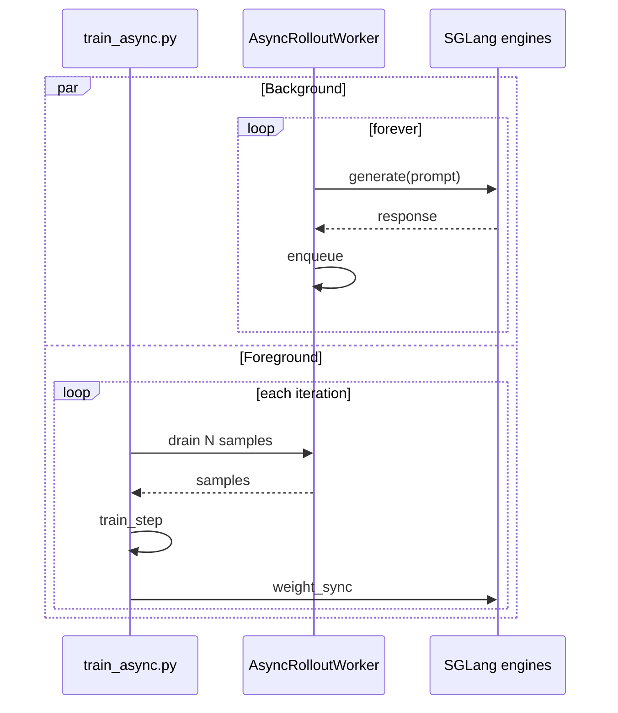

**What you'll learn:** how to make rollout production and trainer consumption fully
parallel, with a queue in between, by using a custom rollout function.

In the default training loop, every iteration looks like:

```text
for it in range(N):
    prompts   = sample()        # cheap
    responses = generate()      # 10-30s
    rewards   = score()         # 1-3s
    loss      = train_step()    # 5-20s
    sync_weights()              # 1-10s
```

`generate()` blocks `train_step()`. With Async Rollout the loop is split: a background
thread runs `generate` continuously, and the trainer drains a queue. The two run in
parallel and the wall-clock time per iteration drops to roughly `max(generate, train)`
instead of the sum.

## Prerequisites

* You completed the [Qwen3-4B](/models/qwen/qwen3) recipe (or have an
  equivalent model + dataset).
* Comfortable with [Customization](/user-guide/customization) — async rollout uses
  a custom rollout function.

## Files

```text
examples/fully_async/
├── fully_async_rollout.py          # AsyncRolloutWorker + entry function
├── run-qwen3-4b-fully_async.sh     # launch script (Qwen3-4B)
└── run_qwen3_30b_a3b_fully_async.py # MoE variant
```

## Quick start

```bash
cd /root/miles
bash examples/fully_async/run-qwen3-4b-fully_async.sh
```

You should see:

```text
Creating new global async worker...
Continuous async rollout worker started
Starting async rollout generation for 32 groups
...
Rollout completed in 41.23s! Global worker queue size: 3
```

## What changes vs. the default recipe

Just two flags:

```diff
- python3 train.py ...
+ python3 train_async.py ...
+   --rollout-function-path fully_async_rollout.generate_rollout_fully_async
```

Everything else — model args, optimizer, GRPO config — stays the same.

## Walkthrough

The interesting code is small. Here's the global worker manager:

```python fully_async_rollout.py
_global_worker = None
_worker_lock = threading.Lock()

def get_global_worker(args, data_buffer):
    global _global_worker
    with _worker_lock:
        if _global_worker is None or not _global_worker.worker_thread.is_alive():
            print("Creating new global async worker...")
            _global_worker = AsyncRolloutWorker(args, data_buffer)
            _global_worker.start()
        return _global_worker
```

Key points:

* **Singleton.** One worker per process — multiple `train.py` calls share it.
* **Thread + asyncio loop.** Cheaper than a subprocess; SGLang HTTP calls are I/O-bound,
  so an asyncio loop in a single thread saturates them.
* **`atexit` hook.** Worker is torn down when the process exits — no orphaned
  generation tasks.

The worker loop (`continuous_worker_loop`, condensed) keeps up to
`--rollout-batch-size` groups in flight using `generate_and_rm_group` — or
`--async-max-concurrent-samples ÷ n_samples_per_prompt` groups when that cap is set:

```python
while self.running:
    # reap finished tasks
    active_tasks -= {task for task in active_tasks if task.done()}

    # top up the in-flight set with fresh groups from the data buffer
    while len(active_tasks) < max_concurrent_tasks and self.running:
        for group in self.data_buffer.get_samples(1):
            task = asyncio.create_task(generate_and_rm_group(
                self.args, group,
                sampling_params=self.state.sampling_params.copy(),
                evaluation=False,
            ))
            task.add_done_callback(...)  # puts the result on self.output_queue
            active_tasks.add(task)

    await asyncio.sleep(1)
```

And the trainer-side entry simply drains:

```python
def generate_rollout_fully_async(args, rollout_id, data_buffer, evaluation=False):
    if evaluation:
        raise ValueError("Evaluation mode not supported in simple async rollout")
    return run(generate_rollout_async(args, rollout_id, data_buffer))
```

`generate_rollout_async` collects completed groups from the worker's output queue
until it has `--rollout-batch-size` of them, recycles any aborted groups back to the
data buffer, and returns the batch sorted by prompt index.

## What's happening underneath



The producer loop is decoupled from the consumer loop. As long as the queue stays
populated, the trainer never blocks on generation.

## Tuning knobs

| Knob | Effect |
|---|---|
| `--rollout-batch-size` | Worker target in-flight group count |
| `--async-max-concurrent-samples` | Hard cap on in-flight samples (overrides the batch-size default) |
| `--sglang-server-concurrency` | Per-engine concurrency cap |
| `--num-steps-per-rollout` | Increase to consume more per drain (off-policy) |

If queue depth grows unbounded, training is slower than rollout — bump
`--num-steps-per-rollout` (you'll be slightly off-policy) or scale up trainer
parallelism.

If queue depth stays at 0, rollout is the bottleneck — that's where async helps least
because there's nothing waiting to be consumed.

## What to watch

The example reports its state through stdout rather than dedicated metrics:

```text
Rollout completed in 41.23s! Global worker queue size: 3
Warning: No progress for 30.0s. Queue size: 0, Collected: 12/32
```

A queue size that stays above zero after each drain means generation is keeping up
with training. The no-progress warning means the trainer is waiting on generation.
In wandb, compare `perf/rollout_time` against `perf/actor_train_time` as usual.

## Limitations

* **No evaluation mode in this example.** Eval still runs through the synchronous path
  in `train_async.py`. Adding async eval is straightforward — copy the worker pattern
  and use `evaluation=True`.
* **Best-effort ordering.** Samples are sorted by index at drain time, but exact-order
  guarantees aren't provided.
* **Minimal error handling.** If a generate task throws, it's logged but the worker
  keeps going. Production users wire in [fault tolerance](/advanced/fault-tolerance).

## Variations

### Async on a 30 B MoE

`run_qwen3_30b_a3b_fully_async.py` shows the same pattern on a 30B MoE:
`--tensor-model-parallel-size 8` and `--expert-model-parallel-size 8` on the training
side, a single 8-GPU SGLang engine (`--rollout-num-gpus-per-engine 8`), and
`--use-tis`. It also demonstrates the two weight-sync combinations for async runs:
`--pause-generation-mode in_place` with `broadcast`, or `retract` with `p2p`.

### Async + R3

Async rollout and R3 stack cleanly. Add:

```bash
GRPO_ARGS+=( --use-rollout-routing-replay )
```

The custom rollout function automatically passes `return_routed_experts=true` because
it uses `generate_and_rm_group` under the hood.

### Async + partial rollout

If you also use `--partial-rollout`, unfinished trajectories are recycled back to the
in-memory data buffer and resume generating in a later batch instead of being thrown
away — useful when weight updates abort in-flight generation.
